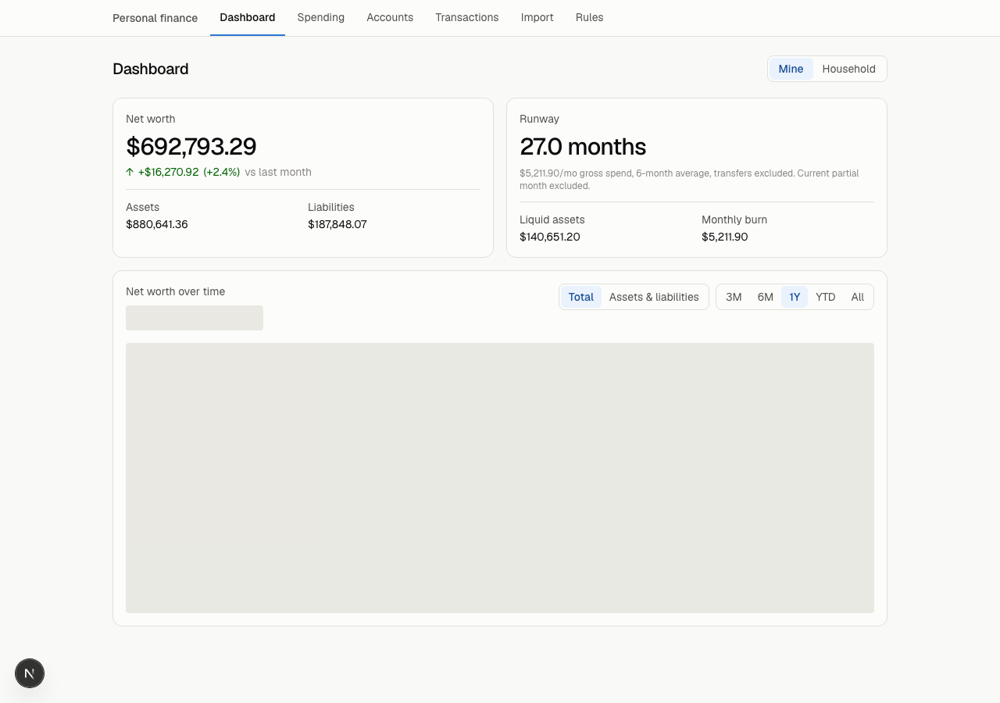
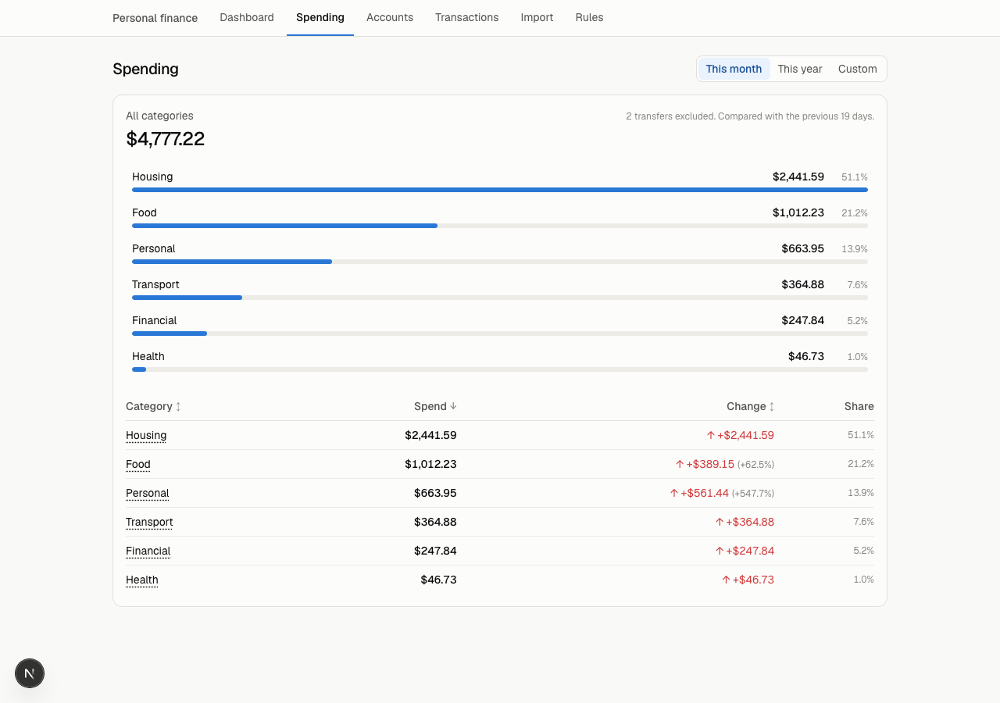
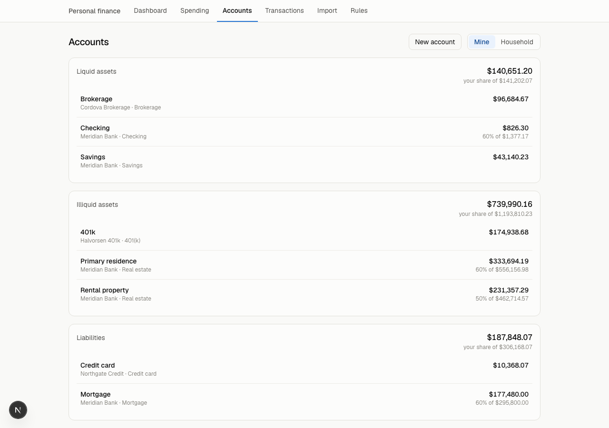
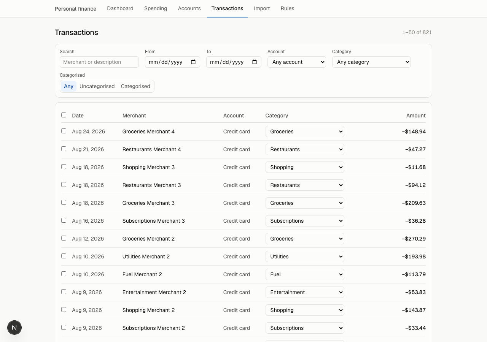
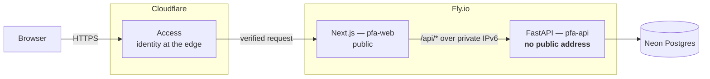

# Personal finance

Net worth, spending, and runway for one household — with **fractional, effective-dated
ownership**, so a 50%-owned property counts for half, and changing that split next year
doesn't rewrite last year's charts.

Next.js and FastAPI on Fly.io, Neon Postgres, behind Cloudflare Access and passkeys.



<details>
<summary>More screens</summary>

**Spending** — parent category to child to transactions, with uncategorised surfaced
rather than hidden.



**Accounts** — grouped by kind, with the ownership-adjusted and raw balance side by side
wherever a stake splits them.



**Transactions** — filters, inline recategorisation, bulk actions.



</details>

## What it does

- **Net worth**, ownership-adjusted, with history from balance snapshots
- **Spending** by category with prior-period comparison and drill-down to transactions
- **Runway** — months of liquid assets at trailing 3/6/12-month gross spend
- **CSV import** with a preview that shows the rows, not just counts, and an idempotent
  upsert so re-importing the same file changes nothing
- **Categorisation rules** with a match preview, which never overwrite a category set by
  hand
- **Mine / Household** toggle — the entire multi-user surface

## Architecture



**The browser never talks to the API.** Every request goes to the Next.js origin, which
proxies `/api/*` to FastAPI over Fly's private network. `fly ips list -a pfa-api` returns
no public address — that one command is most of the security posture.

The API's Pydantic models generate `web/src/lib/api-types.ts`, and CI fails if the
committed file drifts. A wrong URL or a wrong assumption about a response shape is a
compile error rather than a runtime surprise.

## Running it locally

From a clean clone, with Docker and `make`:

```bash
make dev
```

That starts Postgres, the API and the web app with hot reload on both, at
http://localhost:3000. Then, in another terminal:

```bash
make seed
```

30 months of synthetic history: nine accounts, a part-owned rental, a mid-history
ownership change, a closed account, matched transfers, and deliberately uncategorised
rows to try the rules screen against.

The app is behind passkeys. On a database with no passkey registered, `/login` offers to
register one — that window closes as soon as the first one exists.

| Command | What |
|---|---|
| `make dev` | Full stack, hot reload |
| `make seed` | Synthetic data. Resets the database, including registered passkeys |
| `make test` | Guards, pytest, vitest |
| `make e2e` | Playwright against the running stack |
| `make lint` | ruff + mypy + eslint + tsc + prettier |
| `make smoke` | Builds the deploy images and asserts the whole request path works |
| `make types` | Regenerate `api-types.ts` from the Pydantic models |

Two things that will otherwise cost you twenty minutes:

- **Adding a dependency needs a container rebuild.** `docker compose restart` reuses the
  old image and the new import fails at runtime. `make dev` rebuilds, as does
  `docker compose up -d --build <service>`.
- **A brand new route directory** under `web/src/app` is often missed by the dev server's
  file watcher through the bind mount, and 404s until `docker compose restart web`.

## Trade-offs

Every decision here is argued at length in [`docs/DECISIONS.md`](docs/DECISIONS.md) and
[`docs/adr/`](docs/adr/). This section exists because in a year the reasoning will have
evaporated and only the conclusions will remain — and conclusions without reasoning are
how a settled question gets reopened.

**FastAPI + Next.js rather than one framework.** The money logic is genuinely intricate —
effective-dated stakes, rounding that must happen exactly once, snapshot carry-forward —
and Python with `Decimal` and SQLAlchemy expresses it far better than TypeScript with a
decimal library. The UI is genuinely interactive, and React is the right tool for that.
The cost is two ecosystems, two package managers, and a contract between them. The
contract is generated, which turns the main risk into a CI failure rather than a bug.

**The API is private, behind a BFF.** The browser talks only to the Next.js origin. That
means no CORS, no `NEXT_PUBLIC_API_URL`, one TLS certificate, one Cloudflare Access
application, and no second hostname to forget to lock down. A Fly app is publicly
addressable by default, so "Access in front of it" would otherwise be a false sense of
security. The cost is an extra network hop per API call, inside one datacenter — a few
milliseconds, against an attack surface that shrinks to a single origin.

**No Kubernetes, no Terraform.** This is two containers and a database for one household.
Fly's `auto_stop_machines` sleeps them when idle. The infrastructure is four TOML files
and a Makefile; anything more would be operational work that exists to be operated.

**Manual and CSV first, no aggregator.** Plaid and its peers cost real money per
connection, break on bank UI changes, and require handing a third party credentials to
every account. CSV export is universal, free, and works offline. The cost is that
importing is a deliberate act rather than automatic — which, for a monthly review, is
arguably the right cadence anyway. A `SourceAdapter` interface exists so a connector
could be added later without a migration.

**The demo is a separate deployment against a separate Neon project**, not a runtime flag
over real data. A flag is one bad conditional away from serving real balances to the
public internet. Separate projects mean separate credentials, so the demo's database URL
*cannot* reach the real database — the boundary is infrastructure, not code.

**One upfront migration for the whole v1 schema.** Alembic's revision chain is linear and
cannot absorb concurrent branches, and Wave 2 ran three lanes in parallel. Declaring the
whole schema first meant they never collided. The cost was designing tables before
writing the code that used them; it held, with exactly one addition since
(`webauthn_challenges`, for the passkey ceremonies).

**Ownership is effective-dated.** A stake that changes on a date closes the old row and
opens a new one, so past net worth never silently rewrites itself. This costs almost
nothing now — a date range and a lookup helper — and cannot be added cheaply later,
because the history it would need was never recorded.

**Money is integer cents over the wire, `Decimal` in Python, `NUMERIC(19,2)` in
Postgres.** Never a float, anywhere, enforced by a CI guard. Rounding happens exactly
once, per account, in one function. The cost is conversion at both edges; the alternative
is totals that disagree with the rows above them.

## Deploying

**These steps need accounts and a payment method, so they are yours to run.** Everything
after them is scripted.

1. **Register a domain.** [Cloudflare Registrar](https://domains.cloudflare.com) is
   at-cost and puts DNS, Access and R2 in one account.
2. **Create a Neon project** at [neon.tech](https://neon.tech). Copy the **pooled**
   connection string — the host containing `-pooler`.
3. **Install flyctl:** `brew install flyctl && fly auth signup`

Then, from the repo root:

```bash
fly apps create pfa-api
fly apps create pfa-web

fly secrets set -a pfa-api DATABASE_URL='postgresql+psycopg://…-pooler…/neondb?sslmode=require'
fly secrets set -a pfa-api SESSION_SECRET="$(openssl rand -base64 32)"
fly secrets set -a pfa-api RP_ID=allofmymoney.com WEB_ORIGIN=https://allofmymoney.com

# API first — the web app needs it reachable on the private network.
make deploy-api
make deploy-web

fly certs add -a pfa-web allofmymoney.com
```

Then verify the two things that matter:

```bash
# The API must NOT have a public address. Expect no v4 or v6 entry.
fly ips list -a pfa-api

# The web app answers, and reaches the API over the private network.
curl -fsS https://allofmymoney.com/api/ready
```

Migrations run as a Fly `release_command`, before the new version takes traffic, so a
broken migration aborts the release rather than half-migrating under live requests.

Cloudflare Access setup and the checks that prove the origin is locked are in
[`docs/runbooks/access-verification.md`](docs/runbooks/access-verification.md).

## Repository

| Path | What |
|---|---|
| `api/` | FastAPI, SQLAlchemy, Alembic. `uv` for packages |
| `web/` | Next.js App Router, TypeScript, Tailwind. `pnpm` |
| `docs/ARCHITECTURE.md` | Request path, data model, ownership and snapshot design |
| `docs/SECURITY.md` | Threat model, auth, demo isolation, rules for handling real data |
| `docs/DECISIONS.md` | Project-level decisions, newest first |
| `docs/adr/` | Implementation decisions, written as they were made |
| `docs/runbooks/` | Procedures with steps someone has actually run |
| `tickets/` | The build plan — 40 tickets, each with its outcome recorded |
| `data/` | Real financial exports. Gitignored. Never leaves this directory |

## Testing

| Layer | What |
|---|---|
| API | pytest against real migrated Postgres — never SQLite, so a test cannot pass against a schema production does not have |
| Web | vitest + Testing Library + MSW, with fixtures typed from the generated contract |
| Integration | The pipeline through HTTP: import, categorise, read the figure back |
| E2E | Playwright against the compose stack, holding a real passkey via a virtual authenticator |
| Guards | Shell checks with their own self-tests: no float in a money column, no public API URL in the browser bundle, no public Fly service on the API |

Coverage is reported in CI and deliberately not gated on a percentage — a coverage gate
is satisfied by tests that execute code without asserting anything.

## Running cost

Roughly **$0–10/month plus a domain**: Neon free tier, Fly with `auto_stop_machines`,
Cloudflare Zero Trust and R2 free tiers, Sentry and healthchecks.io free tiers, GitHub
Actions free on a public repo. Verify current pricing before committing — these tiers
drift.

## Done

The Google Sheet stops being updated. That's the test.
